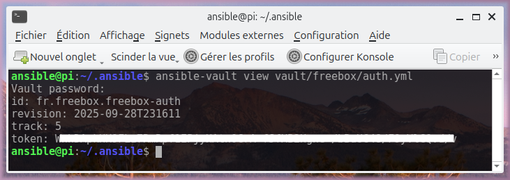

# 🚀 Ansible Role : freebox_auth 🔑

[🇲🇫] Rôle Ansible pour obtenir un jeton d'accès Freebox API.

[🇬🇧] Ansible role for getting a Freebox API Token.


## I) Synopsis.

## [🇲🇫] Objectif : générer un token d'accès général à l'API Freebox (appareil électronique fourni par le fournisseur d'accès à Internet français Free à ses abonnés) stocké dans un fichier Ansible Vault.

1. Une variable `VAULT_PASSWORD` est requise lors du lancement du rôle, à renseigner soit dans la CLI de lancement ou manuellement quand le prompt le demandera.
1. Selon plusieurs scénarios possibles, réalisation de tests pour savoir si une ancienne authentification existe et quoi faire selon le choix de réécriture.
1. Enregistrement d'une application dans Freebox OS.
1. Obtention d'un token d'accès général stocké de manière sécurisée dans un fichier Ansible Vault.

### Scénarios.

|                | ancienne authent valide  | ancienne authent invalide | ancienne authent absente |
|----------------|--------------------------|---------------------------|--------------------------|
| overwrite      | scén 1.1 : nouveau token | scén 1.2 : nouveau token  | scén 3 : nouveau token   |
| sans overwrite | scén 2.1 : stop          | scén 2.2 : stop           | scén 3 : nouveau token   |

## [🇬🇧] Goal : generate a general access token for the Freebox API (a device provided by the French ISP Free to its subscribers) stored in a Ansible Vault file.

1. A `VAULT_PASSWORD` variable is required when launching the role, either provided through the CLI or entered manually when prompted.
1. Depending on some possible scenarios, tests are performed to determine whether a previous authentication exists and what action to take based on the overwrite choice.
1. Application registration in Freebox OS.
1. Retrieval of a general access token securely stored in an Ansible Vault file.

### Scenarios.

|                | legacy authent valid | legacy authent invalid | legacy authent absent |
|----------------|----------------------|------------------------|-----------------------|
| overwrite      | scen 1.1 : new token | scen 1.2 : new token   | scen 3 : new token    |
| no overwrite   | scen 2.1 : stop      | scen 2.2 : stop        | scen 3 : new token    |

> [!important]
> 👋 [🇲🇫] Si votre entreprise souhaite développer en interne des projets Ansible de qualité comme celui ici présent, avec du code moderne, sécurisé et sécurisant, respectueux des bonnes pratiques, testé dans diverses situations et modulaire, alors laissez-moi vos coordonnées sur contact AT fredericpetit.fr 🚀

## II) Requirements / Prérequis.

- Free box
- bash
- openssl
- Ansible software
- Ansible crypto collection (`ansible-galaxy collection install community.crypto`)

## III) Installation.

To add in the _requirements.yml_ file (root of ansible folder for example) :

```yaml
- src: fredericpetit.freebox_auth
  version: 0.0.2
```

Then run : `ansible-galaxy role install -r requirements.yml --force`.

**OR**

```yaml
- src: git+https://gitlab.com/fredericpetit/ansible-role-freebox-auth.git
  version: main
  name: fredericpetit.freebox_auth
```

Roles can be listed with `ansible-galaxy role list`.

## IV) Showcase.

### Ansible Vault file result.



## V) Usage.

Add the role in a playbook, like this (_auth.yml_ file for example):

```yaml
---
- name: Freebox Auth
  hosts: localhost
  become: true
  gather_facts: true

  vars_prompt:
    - name: "VAULT_PASSWORD_PROMPT"
      prompt: "Vault password"
      private: true

  vars:
    freebox_auth_vault:
      path: "/home/ansible/.ansible/vault/freebox/auth.yml"
      password: ""
      uid: "test"
      gid: "test"
      data:
        id: ""
        revision: ""
        track: ""
        token: ""

  roles:
    - fredericpetit.freebox_auth
```

NOTE : replace `fredericpetit.freebox_auth` by `freebox_auth` if role is installed by GIT.

Then run : `ansible-playbook -i inventory playbooks/freebox/auth.yml`

OR with more informations : `VAULT_PASSWORD_CMD="XXXXX" ANSIBLE_LOG_PATH="ansible-$(date '+%Y%m%d-%H%M%S').log" ANSIBLE_CALLBACKS_ENABLED=profile_tasks ANSIBLE_DISPLAY_SKIPPED_HOSTS=false ansible-playbook -i inventory playbooks/freebox/auth.yml`

## VI) Defaults file _defaults/main.yml_.

### WORK

Various tests.

- `freebox_auth_work.legacy.auth.overwrite` (TO BE ADAPTED) – Default: false; an existing authentication will be preserved.

### APP

> [!caution]
> ADAPT ANY NON-EMPTY VALUES.

Application used to query the Freebox OS API.

### VAULT

> [!caution]
> ADAPT ANY NON-EMPTY VALUES, AND/OR THE UID/GID OF A SYSTEM ACCOUNT TO BE USED.

Other parameters defined during the role execution.

### API

The access URL and configuration will be populated in the first playbook.

## VII) Notes.

### HMAC.

[🇲🇫] Dans le cadre de ce rôle Ansible, le HMAC (Hash-based Message Authentication Code) est utilisé pour générer de manière sécurisée un mot de passe de session pour l’API Freebox. En appliquant une fonction de hachage SHA1 combinée à un jeton secret, le HMAC garantit à la fois l’intégrité des données et l’authentification : la valeur calculée prouve que la requête provient d’une source de confiance et que son contenu n’a pas été altéré. Ce mécanisme est essentiel pour établir une session sécurisée avec la Freebox sans exposer directement les informations sensibles.

[🇬🇧] In the context of this Ansible role, HMAC (Hash-based Message Authentication Code) is used to securely generate a session password for the Freebox API. By applying a SHA1 hash combined with a secret token, HMAC ensures both data integrity and authentication: the calculated value proves that the request comes from a trusted source and that its content has not been altered. This mechanism is essential to establish a secure session with the Freebox without exposing sensitive credentials directly.

### `ansible-vault encrypt`.

[🇲🇫] Cette solution évite complètement l'utilisation de fichiers temporaires contenant des secrets, ce qui réduit le risque de fuite du mot de passe ou des données sensibles. Ensuite, elle exploite la substitution de processus (process substitution) pour fournir le mot de passe directement à `ansible-vault encrypt`, éliminant ainsi le besoin d'un flux stdin classique et garantissant que le mot de passe n'apparaît jamais sur le disque ni dans un pipe visible. De plus, toutes les données sont chiffrées en une seule opération, générant un vrai fichier Vault conforme aux standards d'Ansible, ce qui permet ensuite une lecture directe avec `ansible-vault view`. Enfin, le déplacement final du fichier chiffré vers son emplacement définitif assure que le fichier cible est toujours complet et sécurisé, tout en simplifiant la logique du playbook et en minimisant les risques liés aux opérations intermédiaires.

[🇬🇧] This solution completely avoids the use of temporary files containing secrets, which reduces the risk of password or sensitive data leakage. It then leverages process substitution to provide the password directly to `ansible-vault encrypt`, thereby eliminating the need for a traditional stdin stream and ensuring that the password never appears on disk or in a visible pipe. In addition, all data is encrypted in a single operation, producing a genuine Vault file fully compliant with Ansible standards, which can then be directly read using `ansible-vault view`. Finally, moving the encrypted file to its final destination guarantees that the target file is always complete and secure, while simplifying the playbook logic and minimizing risks associated with intermediate operations.

## VIII) Uninstall.

- `ansible-galaxy remove fredericpetit.freebox_auth`

## IX) Beautiful code.


[🇲🇫] Vous pouvez vérfier la validité pleine et entière des bonnes pratiques du code contenu dans ce rôle avec la commande `ansible-lint roles/fredericpetit.freebox_auth/`.

[🇬🇧] You can verify the compliance with best practices of the code contained in this role using the command `ansible-lint roles/fredericpetit.freebox_auth/`.